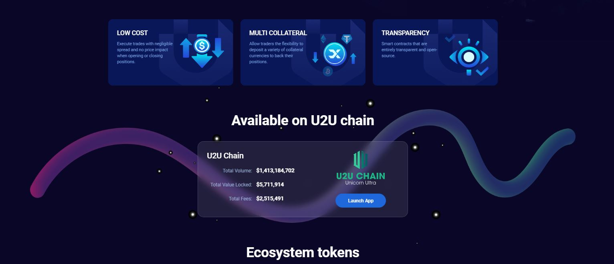

# SocialFi - Decentralized Perpetual Trading Platform

A comprehensive **decentralized perpetual futures exchange (DEX)** built on EVM-compatible chains, featuring advanced trading capabilities, social features, and innovative DeFi solutions.



---

## 🚀 Core DeFi Problems Solved

### 1. **Liquidity Bootstrapping on Low-TVL Chains**

**Problem:** New L1s like U2U (~$10M TVL) struggle with perp DEXes due to no liquidity providers, causing 20-50% slippage and low adoption.

**Our Solution:**

- **Virtual AMM (vAMM)** simulates infinite liquidity without requiring initial LPs
- Enables trades with minimal slippage from day one
- DePIN yields attract early stakers (5-10% APY) to bootstrap real liquidity

### 2. **Cross-Chain Trading Complexity**

**Problem:** Users need to bridge assets across multiple chains to access different perpetual markets.

**Our Solution:**

- **LayerZero Integration** for seamless cross-chain asset transfers
- Unified trading experience across Arbitrum, U2U, and other EVM chains
- Single interface for multi-chain perpetual trading

### 3. **High Trading Fees & Poor UX**

**Problem:** Traditional perp DEXes have complex interfaces and high fees.

**Our Solution:**

- **Intuitive Trading Interface** with real-time charts and order books
- **Competitive Fee Structure** with transparent pricing
- **Social Trading Features** for better user engagement

---

## 🎯 Key Features

### 📈 **Advanced Trading**

- **Perpetual Futures Trading** with up to 50x leverage
- **Real-time Price Feeds** via Chainlink oracles
- **Advanced Order Types** (Market, Limit, Stop-loss)
- **TradingView Integration** for professional charting
- **Order Book & Depth Charts** for market analysis
- **Position Management** with automated liquidation protection

### 💰 **DeFi Integration**

- **Liquidity Provision** with automated market making
- **Staking Rewards** for UTX and ULP tokens
- **Yield Farming** with competitive APRs
- **Governance Participation** through token voting
- **Fee Distribution** to token holders (30% UTX, 70% ULP)

### 🌐 **Cross-Chain Capabilities**

- **Multi-Chain Support** (Arbitrum, U2U, Ethereum)
- **LayerZero Bridge** for seamless asset transfers
- **Unified Wallet Experience** across all chains
- **Cross-Chain Position Management**

### 👥 **Social Trading Features**

- **Trader Profiles** with performance metrics
- **Copy Trading** - follow and replicate successful strategies
- **Social Leaderboards** and achievement systems
- **Community Governance** with on-chain voting
- **Decentralized Identity (DID)** for user profiles
- **Social Feed** for strategy sharing and discussion

### 🔒 **Security & Risk Management**

- **Insurance Fund** for bad debt coverage
- **Automated Liquidation** with fair price discovery
- **Margin Requirements** with real-time monitoring
- **Smart Contract Audits** and security best practices

---

## 🏗️ Technical Architecture

### **Smart Contracts**

- **ClearingHouse** - Main trading logic and position management
- **vAMM** - Virtual automated market maker for liquidity
- **AccountBalance** - Collateral and margin management
- **Funding** - Funding rate mechanism for price alignment
- **InsuranceFund** - Risk management and bad debt coverage
- **Oracle** - Price feed integration and validation

### **Frontend Stack**

- **React.js** with modern UI/UX design
- **Web3 Integration** via ethers.js and Web3React
- **Real-time Data** with WebSocket connections
- **TradingView Charts** for professional analysis
- **Responsive Design** for mobile and desktop

### **Supported Networks**

- **Arbitrum** (Mainnet & Sepolia Testnet)
- **U2U Chain** (Testnet)
- **Ethereum** (via LayerZero)

---

## 🚀 Getting Started

### Prerequisites

- Node.js 18 or 20
- MetaMask or compatible Web3 wallet
- Testnet tokens for testing

### Installation

```bash
# Clone the repository
git clone <repository-url>
cd catalystv1

# Install dependencies
npm install

# Start the development server
npm start
```

### Smart Contract Deployment

```bash
# Navigate to contracts directory
cd src/perp

# Install Hardhat dependencies
npm install

# Compile contracts
npm run compile

# Deploy to testnet
npm run deploy:arbitrum-sepolia
```

---

## 📊 Platform Modules

### 1. **Trade** 📈

Advanced perpetual trading interface with:

- Real-time price charts and market data
- Position management and risk controls
- Order book and depth visualization
- Trading history and performance analytics

### 2. **Dashboard** 📊

Comprehensive analytics dashboard featuring:

- 24h volume and open interest metrics
- Long/short position distributions
- Liquidity pool statistics
- Token performance and governance data

### 3. **Earn** 💎

Staking and yield farming platform:

- UTX and ULP token staking
- Competitive APR rewards
- Vault vesting for reward management
- Pool statistics and performance metrics

### 4. **Buy** 💰

Direct token acquisition:

- UTX (Utility + Governance) - earns 30% platform fees
- ULP (Liquidity Provider) - earns 70% platform fees
- Multiple purchase options (DEX/Centralized)

### 5. **Social** 👥

Community-driven trading features:

- Trader profiles with reputation systems
- Copy trading and strategy sharing
- Community governance and voting
- Leaderboards and achievement systems
- Decentralized messaging and identity

---

## 🔧 Development

### Smart Contract Development

```bash
cd src/perp
npm run compile    # Compile contracts
npm run test       # Run tests
npm run deploy:local  # Deploy to local network
```

### Frontend Development

```bash
npm start          # Start development server
npm run build      # Build for production
npm test           # Run frontend tests
```

---

## 🌟 Vision

This platform represents the future of decentralized trading - where **finance meets community**. We're building more than just a DEX; we're creating a **social ecosystem** that empowers users to:

- **Trade** with institutional-grade tools
- **Earn** through innovative DeFi mechanisms
- **Connect** with a global trading community
- **Govern** the platform's future direction
- **Grow** together in the Web3 economy

---

## 📞 Support

For technical support, feature requests, or community discussions:

- **Documentation**: Check our comprehensive guides
- **Community**: Join our Discord/Telegram
- **Issues**: Report bugs via GitHub Issues

---

_Built with ❤️ for the decentralized future_
